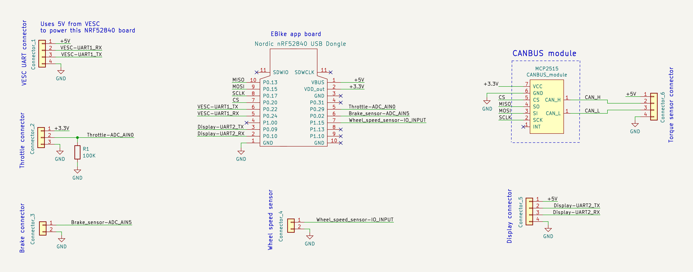

# Python EBike EScooter board
Python EBike/EScooter board + VESC, to replace the original EBike/EScooters original motor controller.

# Tested schematic for DIY EBike board:

Find the CircuitPython firmware on Firmware folder.

See more details here: https://endless-sphere.com/forums/viewtopic.php?f=28&t=100777&e=1&view=unread#p1743945
